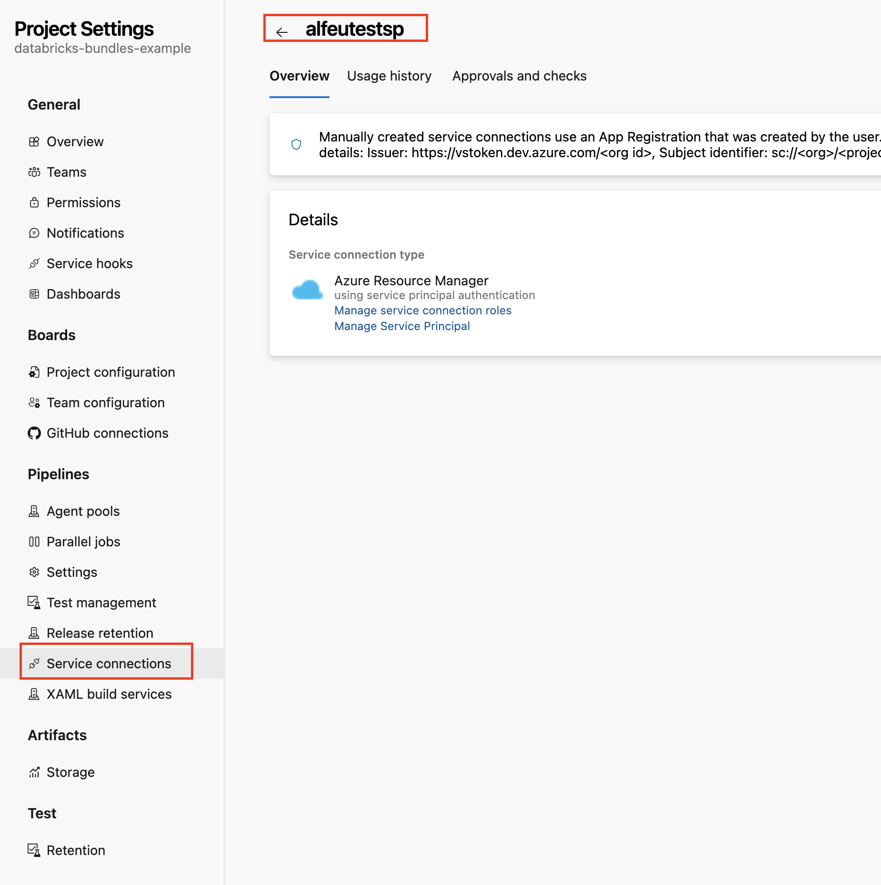
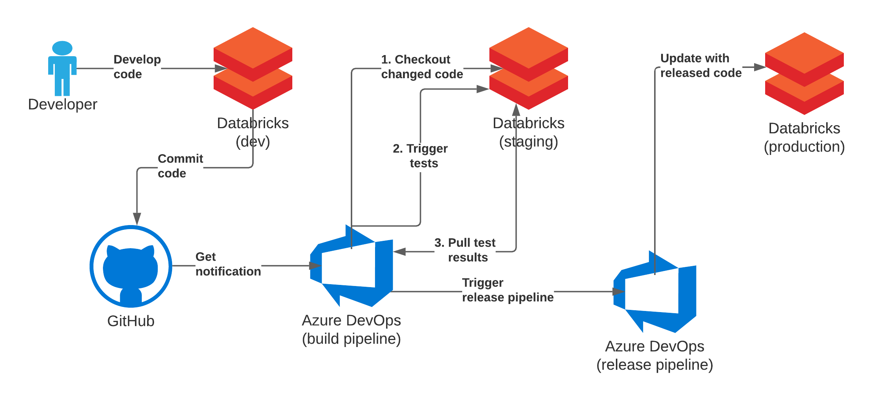
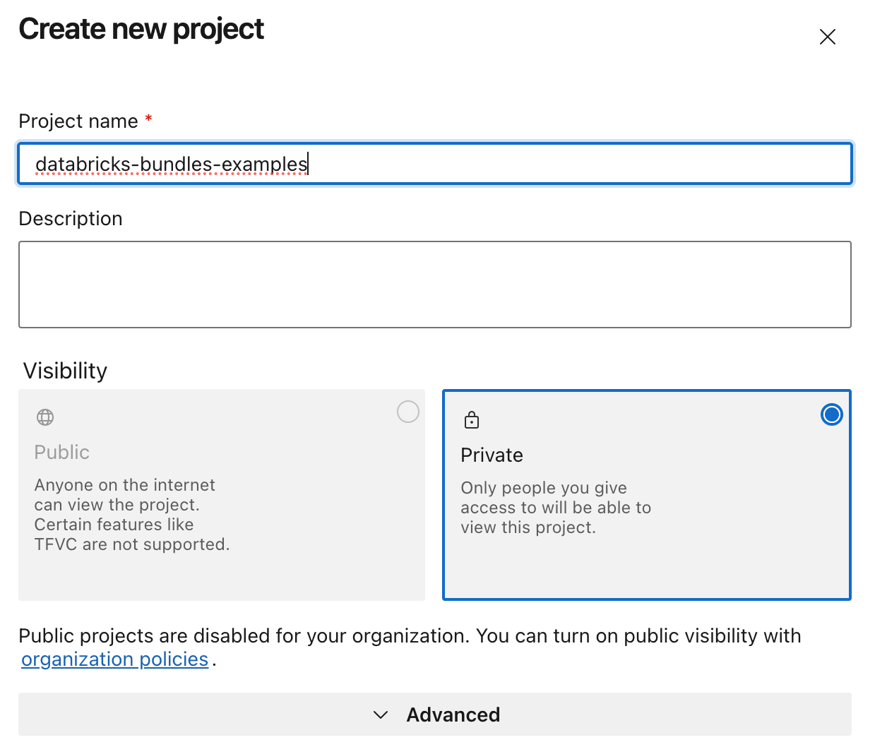
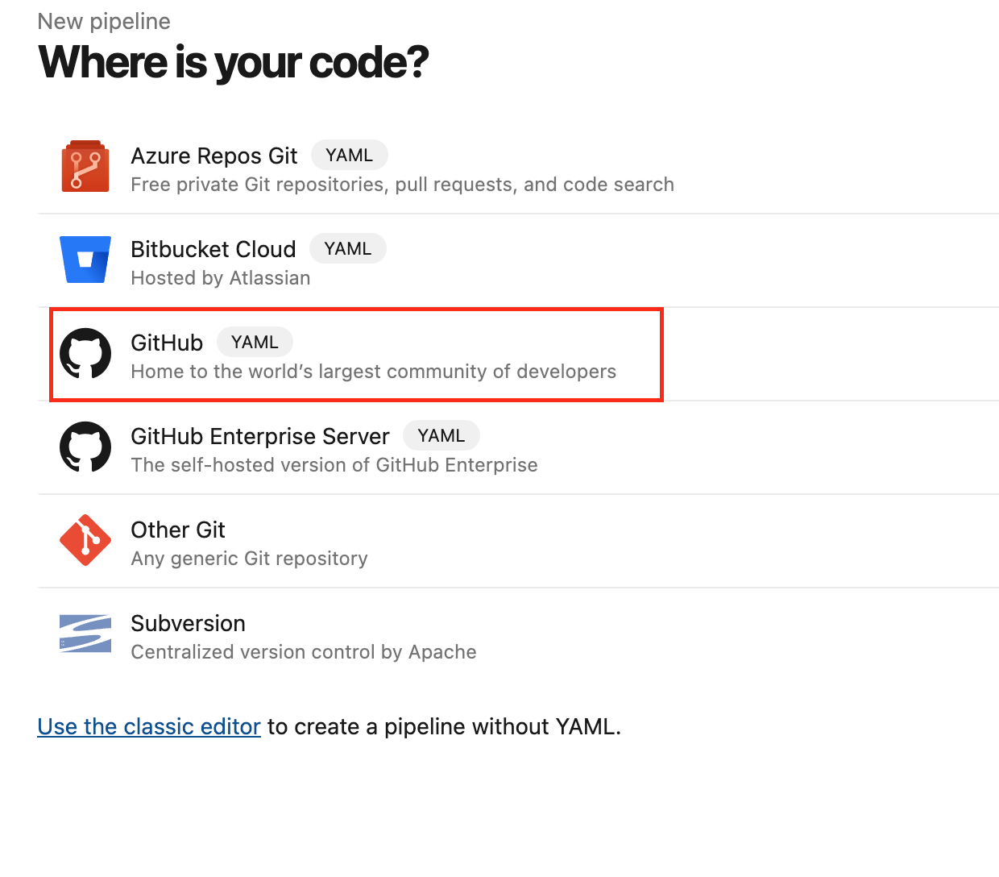
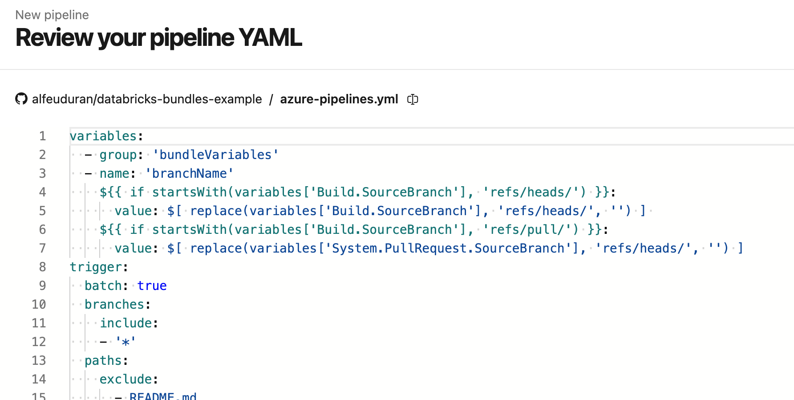
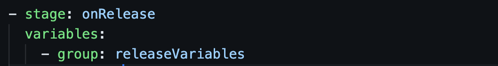
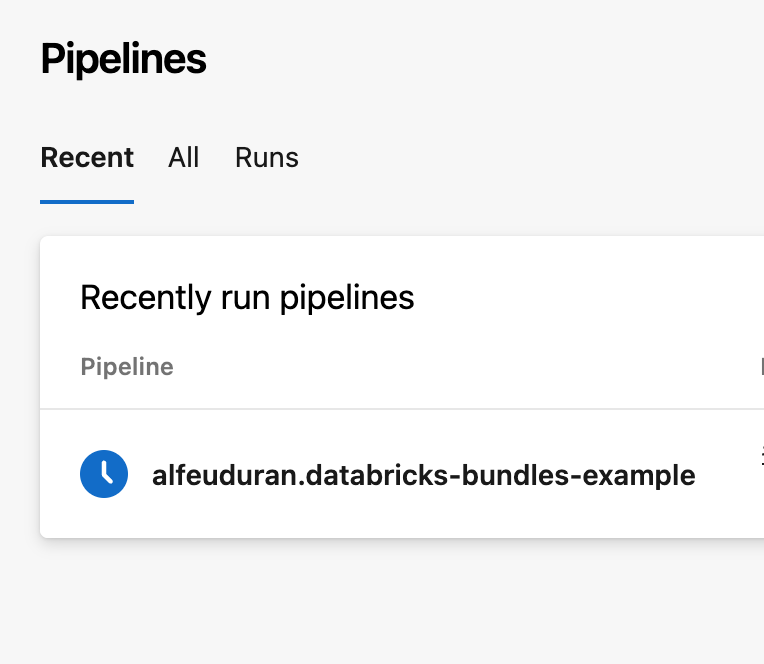
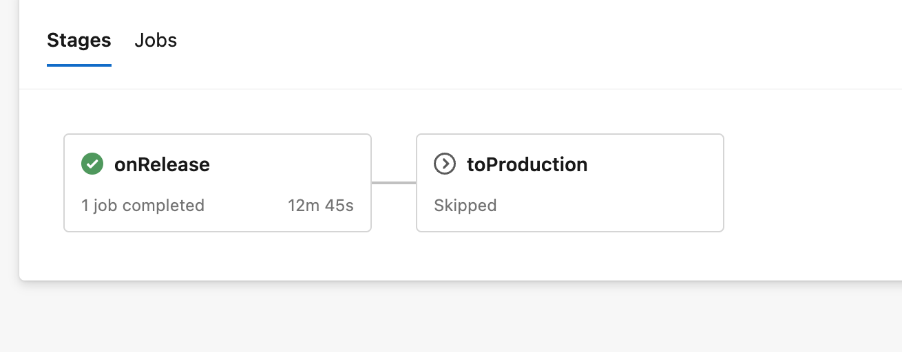

# Databricks Asset Bundles Demo

The 'bundlesDevOpsDemo' project was generated by using the default-python template.
https://docs.databricks.com/en/dev-tools/bundles/templates.html
```
$ databricks bundle init
```

## Running Local

1. Install the Databricks CLI from https://docs.databricks.com/dev-tools/cli/databricks-cli.html

2. Authenticate to your Databricks workspace, if you have not done so already:
    ```
    $ databricks configure
    ```

3. Install python dependencies
   ```
   $ pip install -r requitiments.dev.txt
   ```

4. To deploy a development copy of this project, type:
    ```
    $ databricks bundle deploy --target dev
    ```
    (Note that "dev" is the default target, so the `--target` parameter
    is optional here.)

    This deploys everything that's defined for this project.
    For example, the default template would deploy a job called
    `[dev yourname] bundlesDevOpsDemo_job` to your workspace.
    You can find that job by opening your workpace and clicking on **Workflows**.

4. Similarly, to deploy a production copy, type:
   ```
   $ databricks bundle deploy --target prod
   ```

   Note that the default job from the template has a schedule that runs every day
   (defined in resources/bundlesDevOpsDemo_job.yml). The schedule
   is paused when deploying in development mode (see
   https://docs.databricks.com/dev-tools/bundles/deployment-modes.html).

5. To run a job or pipeline, use the "run" command:
   ```
   $ databricks bundle run
   ```

6. Optionally, install developer tools such as the Databricks extension for Visual Studio Code from
   https://docs.databricks.com/dev-tools/vscode-ext.html. Or read the "getting started" documentation for
   **Databricks Connect** for instructions on running the included Python code from a different IDE.

7. For documentation on the Databricks asset bundles format used
   for this project, and for CI/CD configuration, see
   https://docs.databricks.com/dev-tools/bundles/index.html.


# Service Principal Example

In this example, we will see how to configure a pipeline using a Microsoft Entra application and service principal that can access Databricks.

For detailed instructions on how to create a service principal, please refer to the following documentation:

https://learn.microsoft.com/en-us/entra/identity-platform/howto-create-service-principal-portal

Once the service principal is created, you need to set it up in Azure DevOps by following this documentation:

https://learn.microsoft.com/en-us/azure/devops/pipelines/library/connect-to-azure?view=azure-devops

After configuring the service connection, you will have:



Now, let's use the service principal we configured in the pipeline configuration yml file (azure-pipelines.yml).

Here is the relevant snippet for configuring the service principal:

`In the bellow script, the resource 2ff814a6-3304-4ab8-85cb-cd0e6f879c1d refers to the unique resource ID for the Azure Databricks service. More details here: https://learn.microsoft.com/en-us/azure/databricks/dev-tools/user-aad-token  `


```
- task: AzureCLI@2
      inputs:
        azureSubscription: alfeutestsp
        scriptType: 'bash'
        scriptLocation: 'inlineScript'
        inlineScript: |
          echo "Getting access token..."
          DATABRICKS_TOKEN=$(az account get-access-token --resource 2ff814a6-3304-4ab8-85cb-cd0e6f879c1d --query "accessToken" -o tsv)
          echo "##vso[task.setvariable variable=DATABRICKS_TOKEN]$DATABRICKS_TOKEN"
```


## Deploy to Azure Devops

The pipeline that will be configured will follow the following flow:



The prerequisites for proceeding with the creation of the CI/CD process within Azure are as follows:

1. We create a new project
   

2. We then choose where our code is, in my case the code is in a repository on GitHub
   

3. Since we already have an azure-pipelines.yml file in our repository, it will be automatically selected for the creation of our pipeline in Azure.
   

4. In the two stages we have in this pipeline, we use variables to handle the behavior of our pipeline:
   - Variables can be configured in Pipelines -> Library -> +Variable Group
   - https://learn.microsoft.com/en-us/azure/devops/pipelines/library/variable-groups?view=azure-devops&tabs=classic

    * DATABRICKS_HOST(https://xxx.azuredatabricks.net/)
    * DATABRICKS TOKEN (https://docs.databricks.com/en/dev-tools/auth/pat.html)
    * env (dev/prod)

    

5. As configured in the azure-pipelines.yml, we will run the pipeline for every pull request within the releases branch

6. Once we push to the releases branch, a new pipeline is started
   


## Artifacts
Upon completion, the pipeline artifacts are available in the configured Databricks workspace (databricks.yml).


Refer to the Databricks asset bundles documentation for more detailed information on project configurations and CI/CD integrations.
[Databricks asset bundles documentation](https://docs.databricks.com/en/dev-tools/bundles/index.html)

## Blog


